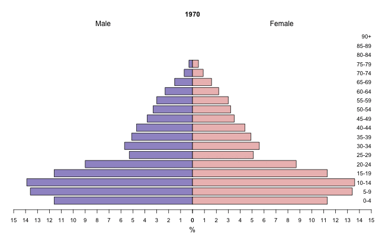

When comparing two distinct groups—like Men vs. Women or Product A vs. Product B—the standard bar chart often falls short. It shows you the volume, but it does not always show you the structure.

Enter the Pyramid Chart.
<details>
<summary>Show Python Data Processing Code</summary>

```python
import pandas as pd

def process_data(csv_file):
    population = pd.read_csv(csv_file)

    total_population = (
        population
        .groupby('year')
        .agg({'total_pop':'sum', 'male_pop':'sum', 'female_pop':'sum'})
        .rename(columns={'male_pop':'total_male_pop', 'female_pop':'total_female_pop'})
        .reset_index()
    )

    df_merged = (
        population.merge(total_population[['year', 'total_male_pop', 'total_female_pop']], on='year', how='left')
    )

    df_merged['male_pct'] = ((df_merged['male_pop'] / df_merged['total_male_pop']) * 100).round(1)
    df_merged['female_pct'] = ((df_merged['female_pop'] / df_merged['total_female_pop']) * 100).round(1)
    df_merged['sex_ratio'] = ((df_merged['male_pop'] / df_merged['female_pop'])*100).round(1)

    df_merged = df_merged[['year', 'age', 'total_pop', 'male_pop', 'female_pop', 'male_pct', 'female_pct', 'sex_ratio']]
    df_merged.sort_values(by=['year', 'age'], ascending=[True,True])
    
    df_merged.to_csv('population_SG.csv', index=False)

process_data('Book1.csv')
```

</details>

<details>
<summary>Show R Animation Code</summary>

```r
library(plotrix)
library(animation)

population <- read.csv("population_SG.csv", stringsAsFactors=FALSE)
population <- population |> sort_by(~ list(year))
ages <- unique(population$age)

ani.options(outdir = paste(getwd(), "/images", sep = ""))
saveGIF(
    for (y in unique(population$year)) {
        pop_year <- subset(population, year == y & age %in% ages)
        female <- pop_year$female_pct
        male <- pop_year$male_pct

        par(cex=0.8, mar=c(5, 4, 6, 2))
        pyramid.plot(
            male,
            female,
            top.labels = c("Male", "", "Female"),
            labels = ages,
            main = y,
            lxcol = "#A097CC",
            rxcol = "#EDBFBE",
            xlim = c(15,15),
            gap = 0
        )
        text(x = 0,  # Center position
             y = -18,  # Position below the plot
             labels = "Source: SINGAPORE DEPARTMENT OF STATISTICS",
             cex = 0.8,  # Text size
             adj = 0.5)  # Center alignment
    }, movie.name = "population-pyramid-animated.gif", 
    interval=0.15, nmax=100, ani.width=650, ani.height=400
)
```

</details>

At its core, a pyramid chart is deceptively simple: it is two bar charts joined by a central spine, facing opposite directions. It is the gold standard for demographic data because it allows our eyes to instantly compare the symmetry (or asymmetry) between two groups. But the real magic happens when you animate it.

A static pyramid chart is a snapshot in time. It tells you what the population looked like in 1990. But data rarely sits still. Populations age, customer bases shift, and trends evolve.

When you apply animation to a pyramid chart over a time axis, you stop looking at bars and start looking at a shifting silhouette

Observe how, in the earlier years, the younger age groups make up a larger proportion of the population, as indicated by the wider base. In later years, the older age groups occupy a larger share, while the younger age groups appear relatively smaller. This is reflected in the changing shape of the pyramid, with a gradual shift in the distribution across different age categories.



<div style="text-align: right; font-size: 12px"> SOURCE: [DEPARTMENT OF STATISTICS, Singapore](https://tablebuilder.singstat.gov.sg/table/TS/M810671) </div>

<!-- SOURCE: [DEPARTMENT OF STATISTICS, Singapore](https://tablebuilder.singstat.gov.sg/table/TS/M810671) -->